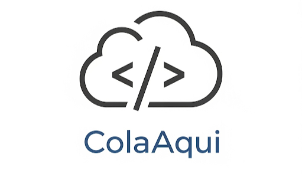

# Introdução
Bem-vindo à documentação do projeto **ColaAqui**!

O ColaAqui é um projeto de aplicação web moderna, minimalista e de código aberto. Ele foi projetado como uma plataforma de conteúdo flexível, capaz de operar de duas maneiras principais:

1.  Como uma ferramenta semelhante ao **Pastebin**, permitindo que usuários compartilhem trechos de texto e código de forma rápida e eficiente através de uma interface simples.
2.  Como um **Micro CMS Headless**, oferecendo uma API para que outras aplicações possam armazenar e consumir blocos de conteúdo de forma programática.

Esta documentação serve como um guia central para desenvolvedores, detalhando desde a arquitetura da solução até guias práticos de desenvolvimento, seja para usar a interface web ou para se integrar com a API.

Para começar, explore as seguintes seções:

- **[Visão Geral](./overview.md):** Entenda o propósito do projeto, suas funcionalidades e as tecnologias utilizadas.
- **[Arquitetura da Solução](./architecture.md):** Mergulhe nos detalhes técnicos de como a plataforma foi construída para suportar ambos os casos de uso.